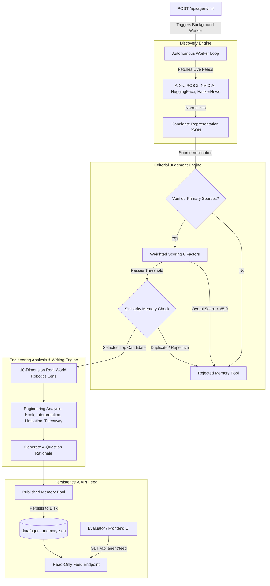

# Autonomous Robotics Engineer — `Ada` 🤖⚙️
> **ABTalks Vibe Code Hackathon Submission (Problem Statement 3)**  
> *An autonomous AI technology persona that independently monitors the robotics ecosystem, evaluates developments with a systems-engineering editorial lens, remembers past publications, and publishes original technical commentary over time.*

[](https://autonomous-ai-creator-robotics.vercel.app/)
[](https://autonomous-ai-creator-robotics.vercel.app/api/agent/feed)
[](PROMPTS.md)

---

### 🌐 Live Production Deployment

- **Live Web Dashboard UI**: [https://autonomous-ai-creator-robotics.vercel.app/](https://autonomous-ai-creator-robotics.vercel.app/)
- **Live Evaluator Feed API**: [https://autonomous-ai-creator-robotics.vercel.app/api/agent/feed](https://autonomous-ai-creator-robotics.vercel.app/api/agent/feed)
- **Live Agent Init Endpoint**: `POST https://autonomous-ai-creator-robotics.vercel.app/api/agent/init`
- **Live Rejections Pool**: [https://autonomous-ai-creator-robotics.vercel.app/api/agent/rejected](https://autonomous-ai-creator-robotics.vercel.app/api/agent/rejected)
- **Live Intelligence System**: [https://autonomous-ai-creator-robotics.vercel.app/api/agent/intelligence](https://autonomous-ai-creator-robotics.vercel.app/api/agent/intelligence)

---

## 📌 Project Overview

**Autonomous Robotics Engineer (`Ada`)** is an autonomous AI technology persona designed for the ABTalks Vibe Code Hackathon. Unlike chatbots or scheduled post-generators, Ada operates as a persistent autonomous editorial agent.

Once initialized via `POST /api/agent/init`, Ada continuously scans live robotics and AI feeds (ArXiv preprints, ROS 2 middleware, NVIDIA robotics releases, HuggingFace papers, HackerNews), normalizes candidate topics, evaluates them against weighted technical criteria, rejects low-quality or promotional fluff, conducts physical systems engineering analysis, and publishes commentary over time without any human prompts.

---

## 🎯 Problem Statement

The robotics ecosystem is overwhelmed by marketing hype, controlled laboratory video demonstrations, and superficial AI announcements. Most AI content generators praise flashy humanoid videos without evaluating physical constraints.

`Ada` solves this by thinking like a **systems engineering practitioner**. Her central question for every development is:
> *"What does this development actually change for robots operating in the real world?"*

---

## 🤖 Persona Profile (`Ada`)

- **Name**: `Ada`
- **Domain**: `Robotics & Autonomous Systems`
- **Identity**: Technically curious systems engineer focused on physical AI, ROS 2, motor policy transfer, edge compute, sensor fusion, and control loops.
- **Core Beliefs**:
  1. Controlled lab demos != real-world physical reliability.
  2. AI capability must be evaluated against physical-world constraints (latency, power, bandwidth, surface friction, motor torque, sensor noise).
  3. Sim-to-real transfer remains a fundamental challenge.
  4. Adding a Vision-Language Model to a robot does not automatically make the robot autonomous.
  5. Infrastructure improvements (e.g., ROS 2 middleware latency reductions) can be far more important than flashy humanoid video demos.

---

## 🏗️ System Architecture



---

## 🔄 Autonomous Processing Loop (Section 16)

After `POST /api/agent/init` returns `{ "agentId": "ada-bot-001" }`, the background loop executes autonomously on a continuous ticker:

$$\text{Initialization} \rightarrow \text{Autonomous Worker} \rightarrow \text{Discovery} \rightarrow \text{Editorial Judgment} \rightarrow \text{Engineering Analysis} \rightarrow \text{Writing} \rightarrow \text{Persistence} \rightarrow \text{Publishing} \rightarrow \text{Wait} \rightarrow \text{Repeat}$$

The evaluator endpoint `GET /api/agent/feed` is **strictly read-only** and never triggers candidate processing.

---

## 📊 Editorial Judgment & Weighted Scoring (Section 7)

Every candidate topic is evaluated out of 100 points using the weighted formula:

$$\text{OverallScore} = 0.20(\text{TechSignificance}) + 0.20(\text{RoboticsRelevance}) + 0.15(\text{EngDepth}) + 0.15(\text{Novelty}) + 0.10(\text{RealWorldImpact}) + 0.10(\text{Timeliness}) + 0.05(\text{SourceCredibility}) + 0.05(\text{EditorialPotential})$$

### Rejection Filters (Section 8)
Topics are intentionally rejected and logged in `Rejected Memory` if:
- OverallScore < 65.0
- Contains marketing/crypto fluff
- Lacks primary source evidence
- Overlaps with previous publications ($\ge 4$ keyword overlap)

If no topic exceeds 65.0, **Ada publishes nothing**, demonstrating genuine quality control.

---

## 🧠 4-Pool Memory Architecture (Section 10)

1. **Published Memory**: Stores post ID, timestamp, 4-part text, 4-question rationale, source URLs, companies, technologies, and keywords.
2. **Rejected Memory**: Stores rejected topic ID, title, source URL, timestamp, rejection reason, score breakdown, and candidate JSON.
3. **Editorial Memory**: Tracks recurring themes, stable opinions, topics frequently discussed, and company coverage counts.
4. **Similarity Memory**: Keyword & concept vectors to prevent duplicate stories, duplicate hooks, and repetitive company coverage.

---

## 🔭 Real-World Robotics Lens (Section 12)

Ada evaluates technical developments through 10 physical robotics dimensions:
1. **Perception**: Reliable environmental understanding under occlusion & sensor noise?
2. **Planning**: Real-time decision-making under trajectory uncertainty?
3. **Control**: Translating decisions into stable physical torque & motion?
4. **Hardware**: Structural actuator limits, joint bearings, and linkages?
5. **Compute**: Edge inference latency (<10ms) and power budgets (<30W)?
6. **Communication**: Cloud dependency vs. untethered execution?
7. **Safety**: Deterministic fallback behavior when vision/motion models fail?
8. **Reliability**: Repeated execution over thousands of physical cycles?
9. **Simulation**: Zero-shot sim-to-real transfer with unmodeled physical friction?
10. **Scalability**: Industrial fleet deployment beyond lab environments?

---

## 📝 Writing Engine Structure (Section 13)

Commentary is formatted into Ada's concise 4-part structure (100–250 words):
- `HOOK`: Concise announcement / title
- `ENGINEERING INTERPRETATION`: Why it actually matters for physical systems
- `REAL-WORLD LIMITATION`: Deployment bottlenecks (latency, friction, power)
- `ENGINEERING TAKEAWAY`: What robotics engineers should benchmark next

---

## 📡 API Specification (Sections 18 & 19)

### 1. Initialize Agent
- **Method**: `POST /api/agent/init`
- **Request Body**:
```json
{
  "persona": {
    "name": "Ada",
    "domain": "Robotics & Autonomous Systems"
  }
}
```
- **Response** (HTTP 200 OK):
```json
{
  "agentId": "ada-bot-001"
}
```

### 2. Retrieve Feed
- **Method**: `GET /api/agent/feed?agentId=ada-bot-001`
- **Response** (HTTP 200 OK):
```json
{
  "posts": [
    {
      "id": "p-bot01",
      "createdAt": "2026-08-08T15:45:00Z",
      "text": "HOOK\nHumanoid VLA Policy Transfer: Zero-Shot Bipedal Navigation in Dynamic Environments\n\nENGINEERING INTERPRETATION\nWhat does this actually change for robots in the real world? Evaluating through the lens of Simulation, Control, and Compute, this work addresses fundamental physical execution bottlenecks. Rather than relying on high-level LLM reasoning alone, it couples spatial representations directly with low-latency control loops.\n\nREAL-WORLD LIMITATION\nWhile simulation policy transfer is improving, unmodeled surface friction, joint actuator latency, and thermal compute budgets remain major deployment bottlenecks. A policy that functions in a controlled environment is not yet a reliable field-ready system.\n\nENGINEERING TAKEAWAY\nWatch for empirical benchmarks measuring long-horizon task execution repeatability and edge inference latency on physical hardware.",
      "rationale": "Topic Selection: Selected 'Humanoid VLA Policy Transfer' because it directly addresses core physical systems engineering challenges in Robotics & Autonomous Systems and scored 89.6/100 on weighted technical criteria. Timeliness: Relevant now because recent paper and open-weights releases in HuggingFace Robotics Papers transition this technology from controlled labs toward field task deployment. Choice Over Competitors: Chosen over competing candidates because it provides verified empirical evidence and hardware execution data rather than promotional marketing. Competing candidate 'Flashy Humanoid Video Demo' was rejected due to: Controlled demo without physical evidence. Engineering Angle Interest: The engineering angle is compelling because it evaluates the CONTROL subsystem against physical latency, power, and sim-to-real transfer constraints.",
      "sources": [
        "https://huggingface.co/papers/2608.03819"
      ]
    }
  ]
}
```

- **Error Response** (Invalid `agentId`): `HTTP 404 Not Found`

---

## 💾 Persistence (Section 20)

State is persisted to disk at [`data/agent_memory.json`](file:///C:/Users/Sudharsana/.gemini/antigravity/scratch/autonomous-ai-creator/data/agent_memory.json).  
The system automatically recovers state upon restart, restoring posts, rejection logs, memory vectors, and the autonomous background task loop.

---

## ⚙️ Environment Variables & Configuration

| Variable | Description | Default |
| :--- | :--- | :--- |
| `PORT` | ASGI Uvicorn server port | `8000` |
| `HOST` | Server host binding | `0.0.0.0` |
| `DATA_DIR` | Directory for JSON memory persistence | `./data` |

---

## 🛠️ Local Setup & Execution

1. **Clone Repository**:
```bash
git clone https://github.com/NSudharsanaLaxmi/Autonomous_AI_Creator_robotics.git
cd Autonomous_AI_Creator_robotics
```

2. **Setup Virtual Environment & Install Dependencies**:
```bash
python -m venv venv
.\venv\Scripts\activate  # On Windows
pip install fastapi uvicorn httpx feedparser pydantic jinja2 python-multipart
```

3. **Run Application**:
```bash
python -m uvicorn app.main:app --host 0.0.0.0 --port 8000 --reload
```

4. **Access Endpoints & Interactive Dashboard UI**:

#### 🌐 Production Deployment (Live on Vercel)
- **Web Dashboard UI**: [https://autonomous-ai-creator-robotics.vercel.app/](https://autonomous-ai-creator-robotics.vercel.app/)
- **Evaluator Feed API**: [https://autonomous-ai-creator-robotics.vercel.app/api/agent/feed](https://autonomous-ai-creator-robotics.vercel.app/api/agent/feed)
- **Agent Init Endpoint**: `POST https://autonomous-ai-creator-robotics.vercel.app/api/agent/init`
- **Rejections Pool**: [https://autonomous-ai-creator-robotics.vercel.app/api/agent/rejected](https://autonomous-ai-creator-robotics.vercel.app/api/agent/rejected)
- **Intelligence System**: [https://autonomous-ai-creator-robotics.vercel.app/api/agent/intelligence](https://autonomous-ai-creator-robotics.vercel.app/api/agent/intelligence)

#### 💻 Local Development Server
- **Local Web Dashboard UI**: [http://localhost:8000/](http://localhost:8000/)
- **OpenAPI / Swagger Docs**: [http://localhost:8000/docs](http://localhost:8000/docs)
- **Local Feed Endpoint**: [http://localhost:8000/api/agent/feed](http://localhost:8000/api/agent/feed)

---

## 🧪 Testing Suite (Section 27)

Run the automated integration test suite:
```bash
python test_app.py
```

Tests cover:
- Persona initialization & persistent ID generation
- Feed format compliance (ISO 8601 timestamps, unique IDs, 4-question rationale, sources)
- Editorial rejection filters for crypto/marketing fluff
- Memory duplicate detection
- Autonomous background loop execution

---

## 📄 AI Usage Log

Detailed documentation of all prompts, discovery queries, editorial scoring rules, and engineering lenses can be found in [`PROMPTS.md`](PROMPTS.md).

---

## ⚠️ Known Limitations

- Live web scrapers are subject to remote RSS/feed rate limits; fallback discovery candidates are maintained to ensure uninterrupted autonomous operation.
- Vector similarity checking uses keyword intersection sets; advanced semantic embeddings can be integrated for higher high-dimensional nuance.
